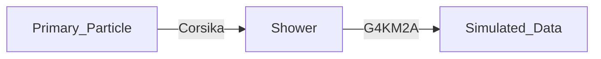

# The Simulation Workflow in the LHAASO-KM2A Group

{:toc}

## 0 Preface

**致谢**：参与部署KM2A Simulation的计算中心的老师，负责KM2A的[赵静老师](mailto:zhaojing_ybj@ihep.ac.cn)。

**适用人群**：本Note主要供KM2A组的同学在需要生成KM2A Monte Carlo模拟数据时，可供参考的简单指南。

**写作动机**：

1. 自己在做KM2A-WCDA联合分析的工作，研究宇宙线电子。为了搞清楚KM2A的lepton/hadron鉴别能力，需要大量的统计量，所以需要重新生成一份可以供KM2A组使用的MC样本。
2. 需要写一个Memo记下部分细节，防止自己哪天突然忘记了。

**改进与交流**：

本作者科研水平和编程水平极为有限。Note中的内容不保证正确性、正确性和客观性，所以请保持批判的态度阅读。如果你是LHAASO组的Newcomer，这个Note恰好就可以供你快速上手，生成一堆MC数据，至于重建每个人的物理目标不一样，我们会另起一篇Note。本Note采用Markdown语言在Typora编辑器(1.5.10 ver.)上编写，放在高能所搭的[HedgeDoc](https://note.ihep.ac.cn/s/pH5U1rIeh)网站和我的[Github](https://easel7.github.io/blogs/KM2A_Corsika_GEANT4)上。手册的排版和视觉效果受限于个人审美，请读者见谅。欢迎各位读者可以通过邮件与我联系交流:[xiongzheng@ihep.ac.cn](mailto:xiongzheng@ihep.ac.cn)。

**Account**

```shell
# KM2AMC Offical Account
km2amc
# Password (If you want to get the permission, please email to zhaojing_ybj@ihep.ac.cn)
*********** 
```

**计算流程**：



**服务器资源**

| Server   | Type | Cores  | 状态                       |
| -------- | ---- | ------ | -------------------------- |
| Beijing  | X86  | ~12000 | 容易在G4KM2A的时候掉事例   |
| Dongguan | x86  | ~8000  | 稳定                       |
| Dongguan | ARM  | ~10000 | 还没来得及做物理结果的对比 |

## 1. Corsika

我们已经准备好两个相互作用模型的Corsika(v77410)放在了cvmfs盘上，分别是EPOS_FLUKA和QGSJET_FLUKA。其中，FLUKA采用的是FLUKA_CERN的fluka4-1.1。Corsika程序运行完之后会生成二进制文件和一份info文件。

### 1.1 需要做的事情

1. 在 `/cvmfs/lhaaso.ihep.ac.cn/km2amc/CORSIKA/corsika-77410_epos_inputcard`路径下设置好自己的Corsika输入卡(corsika inputcard)。
2. 在EOS盘下生成路径保存你的CORSIKA路径。

### 1.2 需要遵从的命名原则

这些需要设置的变量在 `/cvmfs/lhaaso.ihep.ac.cn/km2amc/job_env/km2a_var.sh`中，如果没有，则需要向计算中心的老师或者赵静老师申请添加。

```bash
# 输入卡
/cvmfs/lhaaso.ihep.ac.cn/km2amc/CORSIKA/corsika-77410_epos_inputcard/${PROPOSAL}/${ZENITH}/${MODEL}/TEMPLATE/${PARTICLE}/${ENERGY}.input
# EOS保存路径
/eos/lhaaso/simulation/km2amc/CORSIKA/corsika-77410/${PROPOSAL}/${ZENITH}/${MODEL}/${PARTICLE}/${ENERGY}/${RUNSHELL}/DATA #存放生成的二进制文件
/eos/lhaaso/simulation/km2amc/CORSIKA/corsika-77410/${PROPOSAL}/${ZENITH}/${MODEL}/${PARTICLE}/${ENERGY}/${RUNSHELL}/INPUT #存放输入卡
/eos/lhaaso/simulation/km2amc/CORSIKA/corsika-77410/${PROPOSAL}/${ZENITH}/${MODEL}/${PARTICLE}/${ENERGY}/${RUNSHELL}/LOG   #存放err,out文件
```

**输入卡模板**：

```bash
EVTNR   1                              number of first shower event
# NSHOW   500                            number of showers to generate
# PRMPAR  14                             particle type of prim. particle
ESLOPE  -2.0                           slope of primary energy spectrum
# ERANGE  2.5e4  4.0e4                   energy range of primary particle (GeV)
# THETAP  0.  40.                        range of zenith angle (degree)
PHIP    0.  360.                       range of azimuth angle (degree)
OBSLEV  4424.E2                        observation level (in cm)
FIXHEI  0.  0                          first interaction height & target
FIXCHI  0.                             starting altitude (g/cm**2)
MAGNET  34.618  36.13                  magnetic field centr. Europe
HADFLG  0  0  0  0  0  2               flags hadr.interact.&fragmentation
ECUTS   0.05  0.05  0.0005  0.0005     energy cuts for particles
MUADDI  F                              additional info for muons
MUMULT  T                              muon multiple scattering angle
ELMFLG  F   T                          em. interaction flags (NKG,EGS)
STEPFC  1.0                            mult. scattering step length fact.
RADNKG  200.E2                         outer radius for NKG lat.dens.distr.
ARRANG  0.                             rotation of array to north
# ...                                  interaction model
LONGI   T  10.  T  F                   longit.distr. & step size & fit & out
ECTMAP  1.E2                           cut on gamma factor for printout
MAXPRT  1                              max. number of printed events
DATBAS  T                              write .dbase file
USER    xiongzheng                     user 
DEBUG   F  6  F  1000000               debug flag and log.unit for out
EXIT                                   terminates input
```

 另，编写输入卡的时候，KM2A组内规定：

| Energy      | NSHOW |
| ----------- | ----- |
| 1.e12_1.e13 | 5000  |
| 1.e14_1.e15 | 500   |
| 1.e15_1.e16 | 50    |
| 1.e16_1.e17 | 5     |

想模拟的粒子种类参考[Corsika_GuideBook](https://easel7.github.io/mypaper/userguide.pdf) Page120

| Particle | PRMPAR |
| -------- | ------ |
| Gamma    | 1      |
| Electron | 3      |
| Proton   | 14     |
| Helium   | 402    |
| CNO      | 1407   |
| MgAlSi   | 2713   |
| Fe       | 5626   |

### 1.3  Demo

假如我想生成宇宙线的全粒子MC样本，我需要运行EPOS_FLUKA模型，0-70度，10TeV-100TeV，Proton，1个run（已设置为1个run里面500个corsika文件）。

我们会生成$1*500(\rm{DAT/run})*500\rm{NSHOW/DAT}=25000\rm{NSHOW}$，一共生成2.5E5个proton的shower。

```bash
# create directory
mkdir -p /eos/lhaaso/simulation/km2amc/CORSIKA/corsika-77410/FullComponent/0_70/EPOS_FLUKA/Proton/1.0e13-1.0e14/run001/DATA
mkdir -p /eos/lhaaso/simulation/km2amc/CORSIKA/corsika-77410/FullComponent/0_70/EPOS_FLUKA/Proton/1.0e13-1.0e14/run001/LOG
mkdir -p /eos/lhaaso/simulation/km2amc/CORSIKA/corsika-77410/FullComponent/0_70/EPOS_FLUKA/Proton/1.0e13-1.0e14/run001/INPUT

# Submit Jobs @ lhaasofs
cd /lhaasofs/user/km2amc/Remote_sub


# submit a cluster of jobs (500) to DongGuan
/cvmfs/lhaaso.ihep.ac.cn/km2amc/CORSIKA/corsika-jobscript/hepjob_km2a_corsika.sh ${PROPOSAL} ${ZENITH} ${MODEL} ${PARTICLE} ${ENERGY} ${RUNSHELL} -rmt 
/cvmfs/lhaaso.ihep.ac.cn/km2amc/CORSIKA/corsika-jobscript/hepjob_km2a_corsika.sh FullComponent 0_70 EPOS_FLUKA Proton 1.0e13_1.0e14 1 -rmt
# submit a single job to DongGuan
/cvmfs/lhaaso.ihep.ac.cn/km2amc/CORSIKA/corsika-jobscript/hepjob_km2a_corsika_single_job.sh.sh ${PROPOSAL} ${ZENITH} ${MODEL} ${PARTICLE} ${ENERGY} ${RUNSHELL} ${DAT} -rmt 
/cvmfs/lhaaso.ihep.ac.cn/km2amc/CORSIKA/corsika-jobscript/hepjob_km2a_corsika_single_job.sh FullComponent 0_70 EPOS_FLUKA Proton 1.0e13_1.0e14 1 1 -rmt
```

`/cvmfs/lhaaso.ihep.ac.cn/km2amc/CORSIKA/corsika-jobscript/corsika_job_example.sh`这里有更多的提交方式，例如：提交到北京的节点，东莞的ARM节点。

### 1.4 Corsika检查

为了检查在节点上运行的corsika是否有运行结果，文件是否有问题。可以使用 `/lhaasofs/user/km2amc/xiongzheng/CorsikaCheck`。将直接检查二进制文件中的shower个数是否和我们预期的一致。下面是一个示例脚本：

```bash
#!/bin/bash
source /cvmfs/lhaaso.ihep.ac.cn/anysw/slc5_ia64_gcc73/external/envb.sh
cd /lhaasofs/user/km2amc/xiongzheng/CorsikaCheck/bin
EXE=/lhaasofs/user/km2amc/xiongzheng/CorsikaCheck/bin/CheckFile
INPUTFILE=/eos/lhaaso/simulation/km2amc/CORSIKA/corsika-77410/FullComponent/0_70/EPOS_FLUKA/Proton/1.0e13-1.0e14/run001/DATA/DAT001001 #(your_corsika_file_absolute_path)

time ${EXE} ${INPUTFILE} 500
if [ $? -eq 0 ];then
    echo "ok"
else
    echo "not ok"
fi
```

## 2. G4KM2A

我们已经准备好了G4KM2A模拟程序放在了cvmfs盘上，**理论**上我们记录了所有的事例，$\rm{NtrigE}\ge0$的事例我们都记录下来了。G4KM2A程序会生成一份模拟的root文件和一份报告文本文件info。有时会因为服务器节点的问题，G4KM2A会跑掉几个event，我们最后在检查的时候以info记录的个数为准。东莞的节点比北京的节点更稳定，推荐使用东莞的节点。

### 2.1 需要做的事情

1. 在 `/cvmfs/lhaaso.ihep.ac.cn/km2amc/KM2A_Simulations/G4template/Energy2Reuse.json`路径下设置好自己的G4参数。
2. 在EOS盘下生成路径保存你的G4KM2A路径。

G4KM2A的参数设置，以一个block为例

```json
{
    "Energy": "1.0e13_1.0e14",
    "Nevent": 500,
    "Reuse": 10,
    "ArrayMode": 5,
    "AreaRadius": 400
},
```

在10-100TeV能段下，Corsika的二进制文件为500个NSHOW，我们把每个事例在程序内重复使用$\rm{Nevent}/\rm{NSHOW}=1$次，ArrayMode表明我们需要全阵列模拟，AreaRadius表明我们的投点范围距离LHAASO的中心(200m，600m)。最后一个DAT001001经过G4KM2A模拟后会生成一个root文件，里面有500个文件。

可以根据 `"Nevent"`和 `"Reuse"`的值来控制每个文件的运行时间和总统计量。

### 2.2 需要遵从的命名原则

这些需要设置的变量在 `/cvmfs/lhaaso.ihep.ac.cn/km2amc/job_env/km2a_var.sh`中，如果没有，则需要向计算中心的老师或者赵静老师申请添加。

```bash
# EOS保存路径
/eos/lhaaso/simulation/km2amc/G4KM2A_data/${PROPOSAL}/${ZENITH}/${MODEL}/${PARTICLE}/${ENERGY}/${RUNSHELL}/DATA #存放生成的二进制文件
/eos/lhaaso/simulation/km2amc/G4KM2A_data/${PROPOSAL}/${ZENITH}/${MODEL}/${PARTICLE}/${ENERGY}/${RUNSHELL}/LOG   #存放err,out文件
```

### 2.3 Demo

将1.3里的EPOS_FLUKA模型，0-70度，10TeV-100TeV，Proton，1个run下的500个文件拿来过G4KM2A。一个Corsika文件会被重复用10次，每个shower在程序内只使用一次，则经过G4KM2A后我们一共有$2.5E5\times10=2.5E6$个Proton事例。

```bash
# create dirctory
mkdir -p /eos/lhaaso/simulation/km2amc/G4KM2A_data/FullComponent/0_70/EPOS_FLUKA/Proton/1.0e13-1.0e14/run001/DATA
mkdir -p /eos/lhaaso/simulation/km2amc/G4KM2A_data/FullComponent/0_70/EPOS_FLUKA/Proton/1.0e13-1.0e14/run001/LOG

# Submit Jobs @ lhaasofs
cd /eos/lhaaso/simulation/km2amc/G4KM2A_data/FullComponent/0_70/EPOS_FLUKA/Proton/1.0e13-1.0e14/run001/LOG

# submit a cluster of jobs (500) to DongGuan
/cvmfs/lhaaso.ihep.ac.cn/km2amc/KM2A_Simulations/g4km2a-jobscript/hepjob_km2a_g4km2a.sh ${PROPOSAL} ${ZENITH} ${MODEL} ${PARTICLE} ${ENERGY} ${RUNSHELL} ${REUSE} -rmt 
/cvmfs/lhaaso.ihep.ac.cn/km2amc/KM2A_Simulations/g4km2a-jobscript/hepjob_km2a_g4km2a.sh FullComponent 0_70 EPOS_FLUKA Proton 1.0e13_1.0e14 1 1 -rmt
# submit a single job to DongGuan
/cvmfs/lhaaso.ihep.ac.cn/km2amc/KM2A_Simulations/g4km2a-jobscript/hepjob_km2a_g4km2a.sh ${PROPOSAL} ${ZENITH} ${MODEL} ${PARTICLE} ${ENERGY} ${RUNSHELL} ${REUSE} ${DAT} -rmt 
/cvmfs/lhaaso.ihep.ac.cn/km2amc/KM2A_Simulations/g4km2a-jobscript/hepjob_km2a_g4km2a.sh FullComponent 0_70 EPOS_FLUKA Proton 1.0e13_1.0e14 1 1 1 -rmt
```

**注意**提交任务里的 `${REUSE}`要小于等于json文件里的 `"Reuse"`，否则会报错。`/cvmfs/lhaaso.ihep.ac.cn/km2amc/KM2A_Simulations/g4km2a-jobscript/g4km2a_job_example.sh`这里有更多的提交方式，例如：提交到北京的节点，东莞的ARM节点。

### 2.4 G4KM2A检查

为了检查在节点上运行的corsika是否有运行结果，文件是否有问题。可以使用 `/lhaasofs/user/km2amc/xiongzheng/KM2AMCrec_V3/Check_Event`。将直接检查ROOT文件中的一个tree里记录的info的shower个数是否和我们预期的一致。下面是一个示例脚本：

```bash
#!/bin/bash
source /cvmfs/lhaaso.ihep.ac.cn/anysw/slc6_ia64_gcc73/external/envd.sh
EXE=/lhaasofs/user/km2amc/xiongzheng/KM2AMCrec_V3/Check_Event
INPUTFILE=/eos/lhaaso/simulation/km2amc/G4KM2A_data/FullComponent/0_70/EPOS_FLUKA/Proton/1.0e13-1.0e14/run001/DATA/DAT001001_1.root
NEvent=500

time ${EXE} ${INPUTFILE} ${NEvent}
if [ $? -eq 0 ];then
    echo "ok"
else
    echo "not ok"
fi
```
