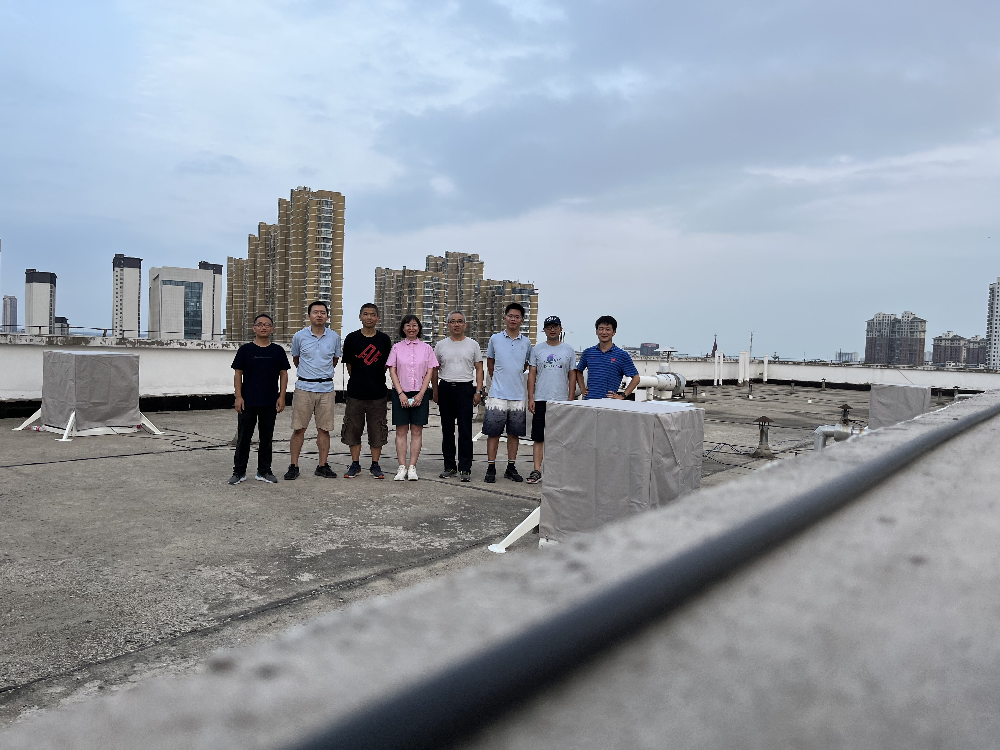
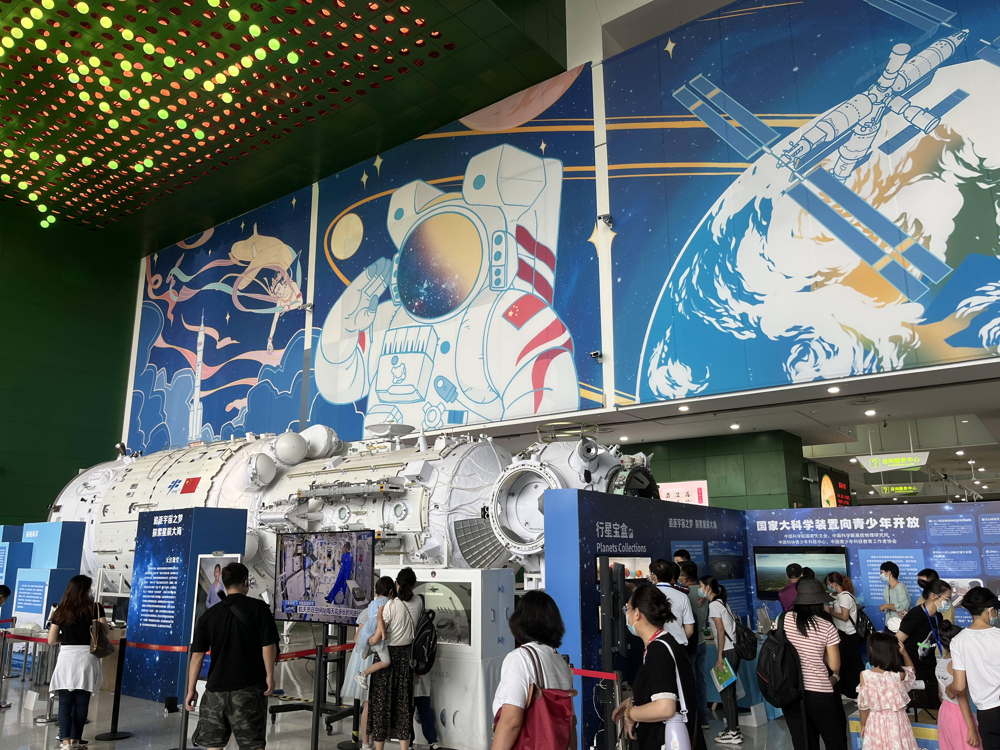

## Teaching & Workshops

As a member in Campus Cosmic-ray Observation Collaboration(CCOC)：

作为校园宇宙线观测联盟的一员：

- 2021,2022国际宇宙日活动中国区 ([口头报告](https://icd.desy.de/https__icddesyde_media/))

- 2022宇宙线观测联盟暑期学校 ([课程1-教材撰写+教学](http://ccoc.ihep.ac.cn/index.php/2022/09/videos/))

- 2022.08江苏姜堰中学宇宙线探测器阵列(空气光导闪烁体探测器)安装调试

  

- 2022.09中国科技馆-全国科普日北京主场活动校园宇宙线活动讲解(入选2022年全国科普日优秀活动)

  

 

<!-- Calendly inline widget begin -->

<!-- Calendly inline widget end -->
